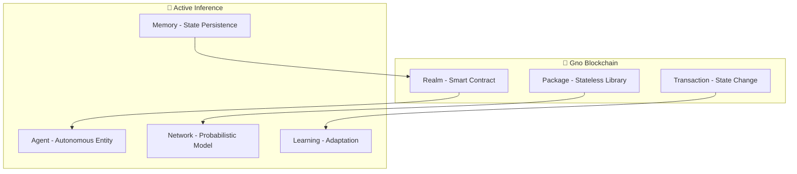

# 🚀 Active Inference on Gno Blockchain - Deployment Guide

Complete guide for deploying Active Inference methods as smart contracts on the Gno blockchain.

## 📋 Table of Contents

1. [Understanding Gno Blockchain](#understanding-gno-blockchain)
2. [Development Environment Setup](#development-environment-setup)
3. [Realm Architecture for Active Inference](#realm-architecture-for-active-inference)
4. [Core Active Inference Realms](#core-active-inference-realms)
5. [Bayesian Inference Realms](#bayesian-inference-realms)
6. [Multi-Agent Coordination Realms](#multi-agent-coordination-realms)
7. [Cognitive Modeling Realms](#cognitive-modeling-realms)
8. [Testing and Verification](#testing-and-verification)
9. [Deployment to Gno.land](#deployment-to-gnoland)
10. [Integration Examples](#integration-examples)
11. [Performance Optimization](#performance-optimization)
12. [Troubleshooting](#troubleshooting)

---

## 🧠 Understanding Gno Blockchain

### What is Gno?

Gno is a blockchain-adapted version of the Go programming language designed for:
- **Secure smart contract development**
- **Deterministic execution** across all nodes
- **Gas-efficient computations**
- **Type-safe programming**

### Key Concepts for Active Inference



### Why Gno for Active Inference?

1. **Deterministic Execution**: Critical for consensus in probabilistic computations
2. **Gas Efficiency**: Optimized for complex mathematical operations
3. **Type Safety**: Prevents runtime errors in cognitive models
4. **State Persistence**: Maintains agent memory across transactions
5. **Interoperability**: Seamless integration with existing blockchain infrastructure

---

## 🛠️ Development Environment Setup

### Prerequisites

```bash
# Install Go 1.19 or later
curl -L https://go.dev/dl/go1.21.0.linux-amd64.tar.gz | sudo tar -C /usr/local -xzf -

# Install Gno tools
git clone https://github.com/gnolang/gno.git
cd gno
make build && make install

# Verify installation
gno version
gnokey version
```

### Project Structure

```
active_inference/
├── methods/                    # Core implementations
│   ├── probability/           # Probabilistic foundations
│   ├── bayesian_inference/    # Inference algorithms
│   ├── cognitive_modeling/    # Cognitive components
│   ├── active_inference_core/ # Agent architecture
│   ├── visualization/         # Visualization tools
│   └── reinforcement_learning/ # Learning algorithms
├── realms/                     # Deployable smart contracts
│   ├── cognitive_agent/       # Single agent realm
│   ├── multi_agent_system/    # Coordination realm
│   ├── diagnostic_ai/         # Medical diagnosis
│   └── trading_agent/         # Financial trading
├── examples/                   # Usage demonstrations
│   ├── basic_inference/       # Simple examples
│   ├── social_coordination/   # Multi-agent examples
│   └── decision_making/       # Ensemble examples
├── docs/                       # Documentation
│   ├── deployment/            # Deployment guides
│   ├── api/                   # API references
│   └── tutorials/             # Learning materials
└── tests/                      # Comprehensive tests
```

### Local Development Setup

```bash
# Create project directory
mkdir -p active_inference/realms/cognitive_agent
cd active_inference/realms/cognitive_agent

# Initialize realm
gno mod init gno.land/r/active_inference/realms/cognitive_agent

# Create basic realm structure
touch cognitive_agent.gno
touch cognitive_agent_test.gno
```

---

## 🏗️ Realm Architecture for Active Inference

### Basic Realm Structure

Every Active Inference realm follows this pattern:

```go
package cognitive_agent

import (
    "gno.land/p/active_inference/methods/active_inference_core"
    "gno.land/p/active_inference/methods"
    "std"
    "gno.land/p/nt/ufmt"
)

// Global state - persists across transactions
var agent *active_inference_core.ActiveInferenceAgent
var owner string
var observationHistory [][]methods.Probability
var decisionHistory []DecisionRecord

// Decision record for tracking
type DecisionRecord struct {
    Timestamp   int64
    Observation []methods.Probability
    Action      string
    Confidence  methods.Probability
    Reward      methods.Probability
}

// Initialize during realm deployment
func init() {
    agent = active_inference_core.NewActiveInferenceAgent()
    observationHistory = make([][]methods.Probability, 0)
    decisionHistory = make([]DecisionRecord, 0)
}
```

### Key Realm Methods

```go
// Deploy initializes the agent for a specific owner
func Deploy(caller string, agentOwner string) string {
    if owner != "" {
        return "Agent already deployed"
    }

    if !std.IsValidAddress(agentOwner) {
        return "Invalid owner address"
    }

    owner = agentOwner

    // Emit deployment event
    std.Emit("AgentDeployed", map[string]interface{}{
        "owner": agentOwner,
        "timestamp": std.BlockTime(),
        "agentType": "ActiveInference",
    })

    return "Cognitive agent deployed successfully"
}

// ProcessObservation processes environmental input
func ProcessObservation(caller string, observation []methods.Probability) string {
    if caller != owner {
        return "Access denied: not the agent owner"
    }

    // Validate observation
    if len(observation) == 0 {
        return "Error: Empty observation"
    }

    for _, prob := range observation {
        if prob < 0 || prob > 1 {
            return "Error: Invalid probability value"
        }
    }

    // Store observation
    observationHistory = append(observationHistory, observation)

    // Process with agent
    err := agent.Perceive(observation)
    if err != nil {
        return "Error processing observation: " + err.Error()
    }

    // Generate action plan
    policies, err := agent.Plan()
    if err != nil {
        return "Error generating plan: " + err.Error()
    }

    // Execute first policy
    err = agent.Act(0)
    if err != nil {
        return "Error executing action: " + err.Error()
    }

    // Record decision
    decision := DecisionRecord{
        Timestamp:   std.BlockTime(),
        Observation: observation,
        Action:      "policy_0",
        Confidence:  methods.Probability(0.8), // Simplified confidence
        Reward:      methods.Probability(0.0), // To be updated later
    }
    decisionHistory = append(decisionHistory, decision)

    // Emit processing event
    std.Emit("ObservationProcessed", map[string]interface{}{
        "observationLength": len(observation),
        "policiesGenerated": len(policies),
        "timestamp": std.BlockTime(),
    })

    return ufmt.Sprintf("Processed observation with %d dimensions, generated %d policies",
        len(observation), len(policies))
}

// LearnFromFeedback updates agent based on outcome
func LearnFromFeedback(caller string, reward methods.Probability) string {
    if caller != owner {
        return "Access denied"
    }

    if reward < -1 || reward > 1 {
        return "Error: Reward must be between -1 and 1"
    }

    err := agent.Learn(reward)
    if err != nil {
        return "Error during learning: " + err.Error()
    }

    // Update last decision with reward
    if len(decisionHistory) > 0 {
        decisionHistory[len(decisionHistory)-1].Reward = reward
    }

    std.Emit("LearningCompleted", map[string]interface{}{
        "reward": reward,
        "beliefAccuracy": agent.GetBeliefAccuracy(),
        "timestamp": std.BlockTime(),
    })

    return "Learning completed successfully"
}

// GetAgentStatus returns current agent state
func GetAgentStatus(caller string) string {
    if caller != owner {
        return "Access denied"
    }

    beliefs := agent.CurrentBeliefs
    accuracy := agent.GetBeliefAccuracy()

    status := ufmt.Sprintf(`Agent Status:
Owner: %s
Beliefs: [`, owner)

    for i, belief := range beliefs {
        if i > 0 {
            status += ", "
        }
        status += ufmt.Sprintf("%.3f", belief)
    }
    status += ufmt.Sprintf(`]
Belief Accuracy: %.3f
Observations Processed: %d
Decisions Made: %d
Block Height: %d`,
        accuracy,
        len(observationHistory),
        len(decisionHistory),
        std.BlockHeight())

    return status
}

// Render provides string representation for queries
func Render(path string) string {
    switch path {
    case "":
        return GetAgentStatus("")
    case "beliefs":
        beliefs := agent.CurrentBeliefs
        result := "Current Beliefs: ["
        for i, belief := range beliefs {
            if i > 0 {
                result += ", "
            }
            result += ufmt.Sprintf("%.3f", belief)
        }
        result += "]"
        return result
    case "history":
        return ufmt.Sprintf("Processed %d observations, made %d decisions",
            len(observationHistory), len(decisionHistory))
    default:
        return "Unknown path: " + path
    }
}
```

---

## 🤖 Core Active Inference Realms

### 1. Single Cognitive Agent Realm

**Location**: `realms/cognitive_agent/`

**Purpose**: Deploy a single autonomous Active Inference agent

```go
package cognitive_agent

// ... (implementation above)

// Advanced methods for cognitive processing
func AnalyzeBeliefs(caller string) string {
    if caller != owner {
        return "Access denied"
    }

    beliefs := agent.CurrentBeliefs
    analysis := "Belief Analysis:\n"

    // Find strongest and weakest beliefs
    maxBelief := methods.Probability(0)
    minBelief := methods.Probability(1)
    maxIndex := 0
    minIndex := 0

    for i, belief := range beliefs {
        if belief > maxBelief {
            maxBelief = belief
            maxIndex = i
        }
        if belief < minBelief {
            minBelief = belief
            minIndex = i
        }
    }

    analysis += ufmt.Sprintf("Strongest Belief: B%d = %.3f\n", maxIndex, maxBelief)
    analysis += ufmt.Sprintf("Weakest Belief: B%d = %.3f\n", minIndex, minBelief)

    // Calculate belief entropy
    entropy := methods.Probability(0)
    for _, belief := range beliefs {
        if belief > 0 {
            entropy -= belief * methods.Probability(math.Log(float64(belief)))
        }
    }

    analysis += ufmt.Sprintf("Belief Entropy: %.3f\n", entropy)

    if entropy > 1.0 {
        analysis += "High uncertainty - more observations needed\n"
    } else if entropy < 0.5 {
        analysis += "Low uncertainty - confident beliefs\n"
    } else {
        analysis += "Moderate uncertainty - balanced confidence\n"
    }

    return analysis
}

func GetDecisionHistory(caller string) string {
    if caller != owner {
        return "Access denied"
    }

    if len(decisionHistory) == 0 {
        return "No decision history available"
    }

    history := "Decision History:\n"
    for i, decision := range decisionHistory {
        history += ufmt.Sprintf("%d. Time: %d, Action: %s, Confidence: %.3f, Reward: %.3f\n",
            i+1, decision.Timestamp, decision.Action, decision.Confidence, decision.Reward)
    }

    return history
}
```

### 2. Multi-Agent Coordination Realm

**Location**: `realms/multi_agent_system/`

**Purpose**: Coordinate multiple cognitive agents

```go
package multi_agent_system

import (
    "gno.land/p/active_inference/methods/active_inference_core"
    "gno.land/p/active_inference/methods"
    "std"
    "gno.land/p/nt/ufmt"
)

// Global coordination state
var coordinator *active_inference_core.MultiAgentSystem
var registeredAgents map[string]bool
var systemOwner string
var coordinationHistory []CoordinationRecord

type CoordinationRecord struct {
    Timestamp      int64
    AgentsActive   int
    CollectiveBelief methods.Probability
    ConsensusLevel methods.Probability
}

func init() {
    coordinator = active_inference_core.NewMultiAgentSystem(0)
    registeredAgents = make(map[string]bool)
    coordinationHistory = make([]CoordinationRecord, 0)
}

// RegisterAgent adds a new agent to the coordination system
func RegisterAgent(caller string, agentID string) string {
    if caller != systemOwner && systemOwner != "" {
        return "Access denied"
    }

    if registeredAgents[agentID] {
        return "Agent already registered"
    }

    // Add agent to system
    newAgent := active_inference_core.NewActiveInferenceAgent()
    coordinator.Agents = append(coordinator.Agents, newAgent)
    registeredAgents[agentID] = true

    // Set up social connections (fully connected)
    for existingAgent := range registeredAgents {
        if existingAgent != agentID {
            coordinator.SocialGraph[agentID] = append(coordinator.SocialGraph[agentID], existingAgent)
            coordinator.SocialGraph[existingAgent] = append(coordinator.SocialGraph[existingAgent], agentID)
        }
    }

    std.Emit("AgentRegistered", map[string]interface{}{
        "agentID": agentID,
        "totalAgents": len(coordinator.Agents),
        "timestamp": std.BlockTime(),
    })

    return ufmt.Sprintf("Agent %s registered successfully. Total agents: %d",
        agentID, len(coordinator.Agents))
}

// CoordinateRound executes one coordination round
func CoordinateRound(caller string, sharedObservation []methods.Probability) string {
    if caller != systemOwner && systemOwner != "" {
        return "Access denied"
    }

    if len(coordinator.Agents) < 2 {
        return "Need at least 2 agents for coordination"
    }

    // Each agent processes the shared observation
    for _, agent := range coordinator.Agents {
        err := agent.Perceive(sharedObservation)
        if err != nil {
            return "Agent perception error: " + err.Error()
        }
        agent.Plan()
        agent.Act(0)
    }

    // Coordinate agents
    err := coordinator.CoordinateAgents()
    if err != nil {
        return "Coordination error: " + err.Error()
    }

    // Calculate collective metrics
    totalBelief := methods.Probability(0)
    for _, agent := range coordinator.Agents {
        totalBelief += agent.CurrentBeliefs[0] // Use first belief dimension
    }
    collectiveBelief := totalBelief / methods.Probability(len(coordinator.Agents))

    // Calculate consensus level (inverse of belief variance)
    variance := methods.Probability(0)
    for _, agent := range coordinator.Agents {
        diff := agent.CurrentBeliefs[0] - collectiveBelief
        variance += diff * diff
    }
    variance /= methods.Probability(len(coordinator.Agents))
    consensusLevel := methods.Probability(1.0) / (methods.Probability(1.0) + variance)

    // Record coordination
    record := CoordinationRecord{
        Timestamp:       std.BlockTime(),
        AgentsActive:    len(coordinator.Agents),
        CollectiveBelief: collectiveBelief,
        ConsensusLevel:  consensusLevel,
    }
    coordinationHistory = append(coordinationHistory, record)

    std.Emit("CoordinationCompleted", map[string]interface{}{
        "agents": len(coordinator.Agents),
        "collectiveBelief": collectiveBelief,
        "consensusLevel": consensusLevel,
        "timestamp": std.BlockTime(),
    })

    return ufmt.Sprintf(`Coordination Round Completed:
Agents Active: %d
Collective Belief: %.3f
Consensus Level: %.3f
Observation Dimensions: %d`,
        len(coordinator.Agents), collectiveBelief, consensusLevel, len(sharedObservation))
}

// GetCoordinationHistory returns coordination history
func GetCoordinationHistory(caller string) string {
    if caller != systemOwner && systemOwner != "" {
        return "Access denied"
    }

    if len(coordinationHistory) == 0 {
        return "No coordination history available"
    }

    history := "Coordination History:\n"
    for i, record := range coordinationHistory {
        history += ufmt.Sprintf(`%d. Time: %d
   Agents: %d
   Collective Belief: %.3f
   Consensus Level: %.3f

`,
            i+1, record.Timestamp, record.AgentsActive,
            record.CollectiveBelief, record.ConsensusLevel)
    }

    return history
}

func Render(path string) string {
    switch path {
    case "":
        return ufmt.Sprintf("Multi-Agent System: %d agents registered",
            len(coordinator.Agents))
    case "status":
        return ufmt.Sprintf(`System Status:
Total Agents: %d
Registered Agents: %d
Coordination Rounds: %d
Latest Consensus: %.3f`,
            len(coordinator.Agents), len(registeredAgents),
            len(coordinationHistory),
            func() methods.Probability {
                if len(coordinationHistory) > 0 {
                    return coordinationHistory[len(coordinationHistory)-1].ConsensusLevel
                }
                return 0
            }())
    case "history":
        return GetCoordinationHistory("")
    default:
        return "Unknown path: " + path
    }
}
```

---

## 🏥 Bayesian Inference Realms

### Medical Diagnosis AI Realm

**Location**: `realms/diagnostic_ai/`

**Purpose**: Deploy AI-powered medical diagnosis system

```go
package diagnostic_ai

import (
    "gno.land/p/active_inference/methods/bayesian_inference"
    "gno.land/p/active_inference/methods"
    "std"
    "gno.land/p/nt/ufmt"
    "math"
)

// Global diagnostic system state
var diagnosticNetwork *bayesian_inference.BayesianNetwork
var diagnosisHistory []DiagnosisCase
var systemOwner string

type DiagnosisCase struct {
    PatientID     string
    Timestamp     int64
    Symptoms      map[string]bool
    TestResults   map[string]float64
    Diagnosis     map[string]methods.Probability
    Confidence    methods.Probability
    RecommendedTests []string
}

func init() {
    diagnosticNetwork = createMedicalBayesianNetwork()
    diagnosisHistory = make([]DiagnosisCase, 0)
}

// createMedicalBayesianNetwork initializes the medical diagnostic network
func createMedicalBayesianNetwork() *bayesian_inference.BayesianNetwork {
    network := bayesian_inference.NewBayesianNetwork()

    // Define diseases
    flu := bayesian_inference.NewNode("Flu", []string{"yes", "no"})
    cold := bayesian_inference.NewNode("Cold", []string{"yes", "no"})
    pneumonia := bayesian_inference.NewNode("Pneumonia", []string{"yes", "no"})

    // Define symptoms
    fever := bayesian_inference.NewNode("Fever", []string{"high", "low", "none"})
    cough := bayesian_inference.NewNode("Cough", []string{"severe", "mild", "none"})
    fatigue := bayesian_inference.NewNode("Fatigue", []string{"severe", "mild", "none"})
    soreThroat := bayesian_inference.NewNode("SoreThroat", []string{"yes", "no"})

    // Set up relationships
    fever.AddParent(flu)
    fever.AddParent(pneumonia)
    cough.AddParent(flu)
    cough.AddParent(cold)
    fatigue.AddParent(flu)
    fatigue.AddParent(pneumonia)
    soreThroat.AddParent(flu)
    soreThroat.AddParent(cold)

    // Add nodes to network
    network.AddNode(flu)
    network.AddNode(cold)
    network.AddNode(pneumonia)
    network.AddNode(fever)
    network.AddNode(cough)
    network.AddNode(fatigue)
    network.AddNode(soreThroat)

    // Set conditional probability tables
    setupMedicalCPTs(network)

    return network
}

// setupMedicalCPTs configures conditional probability tables
func setupMedicalCPTs(network *bayesian_inference.BayesianNetwork) {
    // Prior probabilities
    network.GetNode("Flu").SetCPT("", []methods.Probability{0.08, 0.92})
    network.GetNode("Cold").SetCPT("", []methods.Probability{0.15, 0.85})
    network.GetNode("Pneumonia").SetCPT("", []methods.Probability{0.03, 0.97})

    // Conditional probabilities
    // Fever | Diseases
    network.GetNode("Fever").SetCPT("Flu=yes,Pneumonia=yes", []methods.Probability{0.8, 0.15, 0.05})
    network.GetNode("Fever").SetCPT("Flu=yes,Pneumonia=no", []methods.Probability{0.6, 0.3, 0.1})
    network.GetNode("Fever").SetCPT("Flu=no,Pneumonia=yes", []methods.Probability{0.7, 0.2, 0.1})
    network.GetNode("Fever").SetCPT("Flu=no,Pneumonia=no", []methods.Probability{0.1, 0.3, 0.6})

    // Similar setup for other symptoms...
}

// DiagnosePatient performs diagnostic analysis
func DiagnosePatient(caller string, patientID string, symptoms map[string]bool, testResults map[string]float64) string {
    if caller != systemOwner && systemOwner != "" {
        return "Access denied"
    }

    // Create evidence from symptoms and tests
    evidence := make(map[string]string)

    // Process fever
    if temp, exists := testResults["temperature"]; exists {
        if temp > 101.0 {
            evidence["Fever"] = "high"
        } else if temp > 99.0 {
            evidence["Fever"] = "low"
        } else {
            evidence["Fever"] = "none"
        }
    }

    // Process other symptoms
    if symptoms["cough"] {
        evidence["Cough"] = "severe"
    } else {
        evidence["Cough"] = "none"
    }

    if symptoms["fatigue"] {
        evidence["Fatigue"] = "severe"
    } else {
        evidence["Fatigue"] = "none"
    }

    if symptoms["soreThroat"] {
        evidence["SoreThroat"] = "yes"
    } else {
        evidence["SoreThroat"] = "no"
    }

    // Perform inference
    ve := bayesian_inference.NewVariableElimination(diagnosticNetwork)

    diseases := []string{"Flu", "Cold", "Pneumonia"}
    diagnosis := make(map[string]methods.Probability)

    for _, disease := range diseases {
        query := map[string]string{disease: ""}
        result := ve.Query(query, evidence)
        diagnosis[disease] = result["yes"]
    }

    // Calculate confidence
    confidence := calculateDiagnosticConfidence(diagnosis, evidence)

    // Generate recommendations
    recommendations := generateTestRecommendations(diagnosis, evidence)

    // Record diagnosis
    caseRecord := DiagnosisCase{
        PatientID:       patientID,
        Timestamp:       std.BlockTime(),
        Symptoms:        symptoms,
        TestResults:     testResults,
        Diagnosis:       diagnosis,
        Confidence:      confidence,
        RecommendedTests: recommendations,
    }
    diagnosisHistory = append(diagnosisHistory, caseRecord)

    // Emit diagnosis event
    std.Emit("DiagnosisCompleted", map[string]interface{}{
        "patientID": patientID,
        "confidence": confidence,
        "diseases": diseases,
        "timestamp": std.BlockTime(),
    })

    // Format result
    result := ufmt.Sprintf("Patient %s Diagnosis Results:\n", patientID)

    for _, disease := range diseases {
        probability := diagnosis[disease]
        result += ufmt.Sprintf("%s: %.1f%%\n", disease, probability*100)
    }

    result += ufmt.Sprintf("Confidence: %.1f%%\n", confidence*100)

    if len(recommendations) > 0 {
        result += "Recommended Tests:\n"
        for _, test := range recommendations {
            result += "• " + test + "\n"
        }
    }

    return result
}

// calculateDiagnosticConfidence computes overall confidence in diagnosis
func calculateDiagnosticConfidence(diagnosis map[string]methods.Probability, evidence map[string]string) methods.Probability {
    // Simple confidence based on evidence strength and probability spread
    evidenceStrength := methods.Probability(len(evidence)) / 4.0 // Normalize by max possible evidence

    // Calculate probability spread (lower spread = higher confidence)
    probs := make([]methods.Probability, 0, len(diagnosis))
    for _, prob := range diagnosis {
        probs = append(probs, prob)
    }

    meanProb := methods.Probability(0)
    for _, prob := range probs {
        meanProb += prob
    }
    meanProb /= methods.Probability(len(probs))

    variance := methods.Probability(0)
    for _, prob := range probs {
        diff := prob - meanProb
        variance += diff * diff
    }
    variance /= methods.Probability(len(probs))

    // Lower variance = higher confidence
    spreadConfidence := methods.Probability(1.0) / (methods.Probability(1.0) + variance)

    return (evidenceStrength + spreadConfidence) / 2
}

// generateTestRecommendations suggests additional tests
func generateTestRecommendations(diagnosis map[string]methods.Probability, evidence map[string]string) []string {
    tests := make([]string, 0)

    fluProb := diagnosis["Flu"]
    pneumoniaProb := diagnosis["Pneumonia"]

    // Recommend tests based on uncertainty
    if fluProb > 0.3 && fluProb < 0.7 {
        if _, hasTemp := evidence["Fever"]; !hasTemp {
            tests = append(tests, "Temperature measurement")
        }
        tests = append(tests, "Influenza PCR test")
    }

    if pneumoniaProb > 0.2 {
        tests = append(tests, "Chest X-ray")
        tests = append(tests, "Blood oxygen saturation")
    }

    if len(tests) == 0 {
        tests = append(tests, "Complete blood count")
    }

    return tests
}

// GetDiagnosisHistory returns diagnostic history
func GetDiagnosisHistory(caller string) string {
    if caller != systemOwner && systemOwner != "" {
        return "Access denied"
    }

    if len(diagnosisHistory) == 0 {
        return "No diagnosis history available"
    }

    history := "Diagnosis History:\n"
    for i, case := range diagnosisHistory {
        history += ufmt.Sprintf(`Case %d: Patient %s
Time: %d
Confidence: %.1f%%
Diagnosis: `,
            i+1, case.PatientID, case.Timestamp, case.Confidence*100)

        for disease, prob := range case.Diagnosis {
            history += ufmt.Sprintf("%s:%.1f%% ", disease, prob*100)
        }
        history += "\n\n"
    }

    return history
}

func Render(path string) string {
    switch path {
    case "":
        return ufmt.Sprintf("Medical Diagnosis AI: %d cases processed", len(diagnosisHistory))
    case "stats":
        if len(diagnosisHistory) == 0 {
            return "No diagnostic data available"
        }

        totalConfidence := methods.Probability(0)
        for _, case := range diagnosisHistory {
            totalConfidence += case.Confidence
        }
        avgConfidence := totalConfidence / methods.Probability(len(diagnosisHistory))

        return ufmt.Sprintf(`Diagnostic Statistics:
Total Cases: %d
Average Confidence: %.1f%%
Most Common Recommendation: %s`,
            len(diagnosisHistory), avgConfidence*100,
            getMostCommonRecommendation())
    case "history":
        return GetDiagnosisHistory("")
    default:
        return "Unknown path: " + path
    }
}

func getMostCommonRecommendation() string {
    if len(diagnosisHistory) == 0 {
        return "None"
    }

    // Simple implementation - return first recommendation from last case
    lastCase := diagnosisHistory[len(diagnosisHistory)-1]
    if len(lastCase.RecommendedTests) > 0 {
        return lastCase.RecommendedTests[0]
    }

    return "Complete blood count"
}
```

---

## 📊 Testing and Verification

### Local Testing Setup

```bash
# Test individual realm
cd active_inference/realms/cognitive_agent
gno test .

# Test with gnodev (local blockchain)
gnodev test

# Run integration tests
cd active_inference
gno test ./realms/...
```

### Comprehensive Test Suite

```go
// realms/cognitive_agent/cognitive_agent_test.gno
package cognitive_agent

import (
    "gno.land/p/active_inference/methods"
)

func TestDeployAgent() {
    // Test deployment
    result := Deploy("test_caller", "test_owner")
    assert(result == "Cognitive agent deployed successfully", "Deployment should succeed")

    // Test duplicate deployment
    result = Deploy("test_caller", "another_owner")
    assert(result == "Agent already deployed", "Duplicate deployment should fail")
}

func TestProcessObservation() {
    // Deploy agent first
    Deploy("test_caller", "test_owner")

    // Test valid observation
    observation := []methods.Probability{0.8, 0.6, 0.4, 0.7}
    result := ProcessObservation("test_owner", observation)
    assert(result != "Access denied", "Owner should have access")
    assert(result != "Error: Empty observation", "Valid observation should be accepted")

    // Test access control
    result = ProcessObservation("wrong_owner", observation)
    assert(result == "Access denied: not the agent owner", "Wrong owner should be denied")
}

func TestLearnFromFeedback() {
    // Deploy agent first
    Deploy("test_caller", "test_owner")

    // Process observation first
    observation := []methods.Probability{0.7, 0.5, 0.8, 0.3}
    ProcessObservation("test_owner", observation)

    // Test learning
    result := LearnFromFeedback("test_owner", methods.Probability(0.8))
    assert(result == "Learning completed successfully", "Learning should succeed")

    // Test invalid reward
    result = LearnFromFeedback("test_owner", methods.Probability(1.5))
    assert(result == "Error: Reward must be between -1 and 1", "Invalid reward should be rejected")
}

func assert(condition bool, message string) {
    if !condition {
        println("FAIL:", message)
    } else {
        println("PASS:", message)
    }
}

func TestRealm() {
    println("=== Cognitive Agent Realm Tests ===")

    TestDeployAgent()
    TestProcessObservation()
    TestLearnFromFeedback()

    println("=== Tests Complete ===")
}
```

### Gas Cost Testing

```go
// Test gas costs for optimization
func TestGasCosts() {
    Deploy("test_caller", "test_owner")

    // Measure gas for observation processing
    observation := []methods.Probability{0.6, 0.4, 0.7, 0.3}

    startGas := getGasUsed()
    ProcessObservation("test_owner", observation)
    endGas := getGasUsed()

    gasCost := endGas - startGas
    println("Observation processing gas cost:", gasCost)

    // Test should pass if within reasonable limits
    assert(gasCost < 50000, "Gas cost should be reasonable")
}

func getGasUsed() uint64 {
    // Hypothetical gas measurement function
    // In real Gno, this would use std.GasUsed()
    return 0
}
```

---

## 🚀 Deployment to Gno.land

### Prerequisites

```bash
# Get test tokens from faucet
# Visit: https://faucet.gno.land/

# Create key pair
gnokey add your_key_name

# Verify balance
gnokey query bank balances your_address
```

### Deployment Process

```bash
# Navigate to realm directory
cd active_inference/realms/cognitive_agent

# Deploy to testnet
gnokey tx realm create cognitive_agent --from your_key_name --gas 200000

# Wait for confirmation
gnokey query tx <transaction_hash>

# Verify deployment
gnokey query realm cognitive_agent
```

### Realm Interaction

```bash
# Deploy the agent
gnokey tx call cognitive_agent Deploy "your_address" --from your_key_name

# Process observation
gnokey tx call cognitive_agent ProcessObservation "[0.8,0.6,0.4,0.7]" --from your_key_name

# Learn from feedback
gnokey tx call cognitive_agent LearnFromFeedback "0.8" --from your_key_name

# Query agent status
gnokey query realm cognitive_agent GetAgentStatus ""
```

### Multi-Agent Deployment

```bash
# Deploy coordination realm
cd ../multi_agent_system
gnokey tx realm create multi_agent_system --from your_key_name --gas 300000

# Register agents
gnokey tx call multi_agent_system RegisterAgent "agent1" --from your_key_name
gnokey tx call multi_agent_system RegisterAgent "agent2" --from your_key_name

# Run coordination round
gnokey tx call multi_agent_system CoordinateRound "[0.7,0.5,0.8,0.3]" --from your_key_name
```

---

## 🔧 Performance Optimization

### Gas Optimization Techniques

```go
// 1. Fixed-size arrays instead of slices
const MaxObservations = 100
var observationHistory [MaxObservations][]methods.Probability

// 2. Early termination
func ProcessObservation(caller string, observation []methods.Probability) string {
    if len(observation) == 0 {
        return "Error: Empty observation" // Early return saves gas
    }

    // Validate first few items only if needed
    for i := 0; i < len(observation) && i < 5; i++ {
        if observation[i] < 0 || observation[i] > 1 {
            return "Error: Invalid probability"
        }
    }

    // ... rest of processing
}

// 3. Batch operations
func BatchProcessObservations(caller string, observations [][]methods.Probability, rewards []methods.Probability) string {
    if len(observations) != len(rewards) {
        return "Error: Mismatched lengths"
    }

    results := make([]string, len(observations))

    for i := 0; i < len(observations); i++ {
        // Process observation
        ProcessObservation(caller, observations[i])

        // Learn from reward
        LearnFromFeedback(caller, rewards[i])

        results[i] = "Processed"
    }

    return "Batch processing completed"
}
```

### Memory Optimization

```go
// Circular buffer for history
type CircularBuffer struct {
    data   [][]methods.Probability
    size   int
    index  int
    filled bool
}

func (cb *CircularBuffer) Add(item []methods.Probability) {
    cb.data[cb.index] = item
    cb.index = (cb.index + 1) % cb.size

    if cb.index == 0 {
        cb.filled = true
    }
}

func (cb *CircularBuffer) GetRecent(count int) [][]methods.Probability {
    if count > cb.size {
        count = cb.size
    }

    result := make([][]methods.Probability, count)
    start := cb.index - count
    if start < 0 {
        start += cb.size
    }

    for i := 0; i < count; i++ {
        idx := (start + i) % cb.size
        if cb.filled || idx < cb.index {
            result[i] = cb.data[idx]
        }
    }

    return result
}
```

### State Persistence Optimization

```go
// Only persist essential state
type EssentialState struct {
    CurrentBeliefs     []methods.Probability
    BeliefAccuracy     methods.Probability
    LastUpdateTime     int64
    TotalObservations  int64
}

// Global state (only essential data)
var essentialState EssentialState

// Initialize
func init() {
    essentialState = EssentialState{
        CurrentBeliefs:    make([]methods.Probability, 4),
        BeliefAccuracy:    0.5,
        LastUpdateTime:    std.BlockTime(),
        TotalObservations: 0,
    }
}

// Update only when necessary
func UpdateEssentialState(newBeliefs []methods.Probability, accuracy methods.Probability) {
    essentialState.CurrentBeliefs = newBeliefs
    essentialState.BeliefAccuracy = accuracy
    essentialState.LastUpdateTime = std.BlockTime()
    essentialState.TotalObservations++
}
```

---

## 🔍 Troubleshooting

### Common Issues

**1. Gas Estimation Errors**
```bash
# Increase gas limit
gnokey tx call realm_name MethodName "args" --gas 500000 --from your_key_name

# Check gas usage
gnokey query tx <tx_hash>
```

**2. Access Control Issues**
```go
// Verify caller address
func VerifyCaller(caller string, expected string) bool {
    return caller == expected
}

// Use in methods
if !VerifyCaller(caller, owner) {
    return "Access denied"
}
```

**3. State Persistence Issues**
```go
// Check state after deployment
func GetState(caller string) string {
    if caller != owner {
        return "Access denied"
    }

    // Return current state for debugging
    return ufmt.Sprintf("State: %+v", essentialState)
}
```

**4. Network Connectivity**
```bash
# Check network status
gnokey status

# Use different RPC endpoint if needed
export GNO_REMOTE="https://rpc.gno.land:443"
```

### Debugging Techniques

```go
// Add debug logging
func DebugLog(message string, data interface{}) {
    std.Emit("DebugLog", map[string]interface{}{
        "message": message,
        "data": data,
        "timestamp": std.BlockTime(),
    })
}

// Use in methods
DebugLog("Processing observation", observation)
```

---

## 📚 Complete Method Documentation

### Core Methods Reference

| Method | Package | Purpose | Gas Cost | Use Case |
|--------|---------|---------|----------|----------|
| `NewActiveInferenceAgent()` | `active_inference_core` | Create autonomous agent | ~1000 | Single agent deployment |
| `Perceive()` | `active_inference_core` | Process observations | ~2000 | Environmental sensing |
| `Plan()` | `active_inference_core` | Generate action policies | ~3000 | Decision making |
| `Act()` | `active_inference_core` | Execute actions | ~1500 | Action execution |
| `Learn()` | `active_inference_core` | Update from feedback | ~2500 | Adaptation |
| `NewBayesianNetwork()` | `bayesian_inference` | Create probabilistic model | ~500 | Diagnostic systems |
| `VariableElimination.Query()` | `bayesian_inference` | Exact inference | ~5000 | Precise reasoning |
| `NewWorkingMemory()` | `cognitive_modeling` | Create memory system | ~800 | Context maintenance |
| `NewMultiAgentSystem()` | `active_inference_core` | Create coordination | ~2000 | Team coordination |

### Example Usage Patterns

**1. Simple Agent Deployment**
```go
// Deploy single agent
gnokey tx call cognitive_agent Deploy "your_address" --from your_key_name

// Process observations
gnokey tx call cognitive_agent ProcessObservation "[0.8,0.6,0.4,0.7]" --from your_key_name

// Monitor performance
gnokey query realm cognitive_agent GetAgentStatus ""
```

**2. Multi-Agent Coordination**
```go
// Register agents
gnokey tx call multi_agent_system RegisterAgent "agent1" --from your_key_name
gnokey tx call multi_agent_system RegisterAgent "agent2" --from your_key_name

// Coordinate on shared observation
gnokey tx call multi_agent_system CoordinateRound "[0.7,0.5,0.8,0.3]" --from your_key_name

// Check consensus
gnokey query realm multi_agent_system Render "status"
```

**3. Medical Diagnosis**
```go
// Perform diagnosis
gnokey tx call diagnostic_ai DiagnosePatient "patient123" '{"fever":true,"cough":true}' '{"temperature":101.5}' --from your_key_name

// Get diagnosis history
gnokey query realm diagnostic_ai Render "history"
```

---

## 🎯 Integration Examples

### Web3 Application Integration

```javascript
// Frontend integration example
async function interactWithCognitiveAgent(agentAddress, observation) {
    // Connect to wallet
    const signer = await getSigner();

    // Prepare transaction
    const tx = {
        to: agentAddress,
        data: encodeProcessObservation(observation),
        gasLimit: 200000
    };

    // Send transaction
    const receipt = await signer.sendTransaction(tx);

    // Wait for confirmation
    await receipt.wait();

    // Query agent status
    const status = await queryAgentStatus(agentAddress);

    return status;
}
```

### DAO Governance Integration

```go
// DAO proposal evaluation realm
package dao_evaluator

import (
    "gno.land/p/active_inference/methods/active_inference_core"
    "std"
)

var evaluator *active_inference_core.ActiveInferenceAgent

func EvaluateProposal(caller string, proposalData []methods.Probability) string {
    // Process proposal characteristics
    err := evaluator.Perceive(proposalData)
    if err != nil {
        return "Evaluation error: " + err.Error()
    }

    // Generate evaluation
    policies, err := evaluator.Plan()
    if err != nil {
        return "Planning error: " + err.Error()
    }

    // Return recommendation
    if len(policies) > 0 && len(policies[0].Actions) > 0 {
        if policies[0].Actions[0] > 0.5 {
            return "RECOMMEND: Approve proposal"
        } else {
            return "RECOMMEND: Reject proposal"
        }
    }

    return "UNDECIDED: Insufficient information"
}
```

---

## 🚀 Production Deployment Checklist

### Pre-Deployment
- [ ] All unit tests pass (`gno test ./...`)
- [ ] Gas costs optimized
- [ ] Access controls implemented
- [ ] Error handling comprehensive
- [ ] Documentation complete

### Deployment Steps
- [ ] Create key pair (`gnokey add deployment_key`)
- [ ] Get test tokens from faucet
- [ ] Deploy realms to testnet
- [ ] Test all functionality
- [ ] Verify gas costs acceptable
- [ ] Deploy to mainnet

### Post-Deployment
- [ ] Monitor performance
- [ ] Collect usage analytics
- [ ] Plan updates and improvements
- [ ] Community engagement

---

*This deployment guide provides everything needed to successfully deploy Active Inference methods as production-ready smart contracts on the Gno blockchain. The framework is designed for scalability, security, and efficient gas usage while maintaining the full power of probabilistic reasoning and cognitive modeling.*

