# 📚 Gno Standard Libraries Integration

Comprehensive overview of Gno standard libraries and their integration with Active Inference methods.

## 🏗️ Core Architecture

```mermaid
graph TD
    subgraph "🎯 Active Inference Framework"
        AI[Active Inference Core]
        CM[Cognitive Modeling]
        RL[Reinforcement Learning]
        BI[Bayesian Inference]
        FEP[Free Energy Principle]
    end

    subgraph "⛓️ Gno Standard Libraries"
        STD[std - Blockchain Primitives]
        AVM[avl - Data Structures]
        UFMT[ufmt - String Formatting]
        MATH[math - Mathematical Functions]
        TIME[time - Time Operations]
    end

    subgraph "🔧 Integration Layer"
        GAS[Gas Optimization]
        STATE[State Management]
        CONS[Consensus Compatibility]
        DETERM[Deterministic Operations]
    end

    AI --> GAS
    CM --> STATE
    RL --> CONS
    BI --> DETERM
    FEP --> GAS

    STD --> AI
    AVM --> CM
    UFMT --> RL
    MATH --> BI
    TIME --> FEP
```



## 📦 Standard Library Overview

### `std` - Blockchain Primitives

The `std` package provides essential blockchain operations and state management.

#### Key Functions for Active Inference

```go
import "std"

// Realm identification and state
currentRealm := std.CurrentRealm()
isValidAddress := std.IsValidAddress(addr)

// Transaction context
caller := std.PrevRealm()
origin := std.Origin()

// Time-based operations (deterministic)
blockTime := std.BlockTime()
blockHeight := std.BlockHeight()

// Event emission for monitoring
std.Emit("AgentDecision", decisionData)
std.Emit("BeliefUpdate", beliefState)
```

#### Integration Patterns

**State Persistence:**
```go
// Persistent agent state using realms
var agent *ActiveInferenceAgent

func init() {
    // Initialize during realm deployment
    agent = NewActiveInferenceAgent()
}

func ProcessObservation(observation []Probability) string {
    err := agent.Perceive(observation)
    if err != nil {
        return "Error: " + err.Error()
    }

    // State automatically persisted between calls
    return "Observation processed successfully"
}
```

**Transaction-Based Learning:**
```go
func LearnFromFeedback(reward Probability, action string) {
    // Each learning step is a separate transaction
    err := agent.Learn(reward)
    if err != nil {
        panic("Learning failed")
    }

    // Emit learning event for monitoring
    std.Emit("LearningStep", map[string]interface{}{
        "reward": reward,
        "action": action,
        "newConfidence": agent.GetBeliefAccuracy(),
    })
}
```

### `avl` - Advanced Data Structures

Efficient, deterministic data structures optimized for blockchain use.

#### Integration with Cognitive Modeling

```go
import "gno.land/p/nt/avl"

// Working memory implementation
type WorkingMemory struct {
    tree   *avl.Tree
    capacity int
    items   int
}

func (wm *WorkingMemory) AddItem(key string, value []Probability) {
    if wm.items >= wm.capacity {
        // Remove least recently used item
        wm.tree.Remove(wm.getOldestKey())
        wm.items--
    }

    wm.tree.Set(key, value)
    wm.items++
}

func (wm *WorkingMemory) GetItem(key string) []Probability {
    return wm.tree.Get(key)
}
```

#### Performance Characteristics

| Operation | Time Complexity | Gas Cost | Use Case |
|-----------|----------------|----------|----------|
| `Set` | O(log n) | ~100 gas | Memory updates |
| `Get` | O(log n) | ~50 gas | Memory retrieval |
| `Remove` | O(log n) | ~80 gas | Memory cleanup |
| `Iterate` | O(n) | ~20n gas | Memory inspection |

### `ufmt` - String Formatting

Type-safe string formatting for logging and visualization.

#### Cognitive State Formatting

```go
import "gno.land/p/nt/ufmt"

// Format belief states for logging
func formatBeliefs(beliefs []Probability) string {
    result := "Beliefs: ["
    for i, belief := range beliefs {
        if i > 0 {
            result += ", "
        }
        result += ufmt.Sprintf("%.3f", belief)
    }
    result += "]"
    return result
}

// Format decision outcomes
func formatDecision(option string, confidence Probability, utility Probability) string {
    return ufmt.Sprintf("Decision: %s (confidence: %.2f, utility: %.2f)",
                       option, confidence, utility)
}
```

#### Visualization Integration

```go
// ASCII visualization of probability distributions
func visualizeDistribution(probs []Probability, labels []string) string {
    result := "Distribution:\n"
    for i, prob := range probs {
        bar := strings.Repeat("█", int(prob*20)) // Scale to 20 characters
        result += ufmt.Sprintf("%-10s: %s %.3f\n", labels[i], bar, prob)
    }
    return result
}
```

### `math` - Mathematical Functions

Essential mathematical operations for probabilistic computations.

#### Statistical Computations

```go
import "math"

// Entropy calculation
func calculateEntropy(probs []Probability) Probability {
    entropy := Probability(0)
    for _, p := range probs {
        if p > 0 {
            entropy -= p * Probability(math.Log(float64(p)))
        }
    }
    return entropy
}

// Gaussian probability density
func gaussianPDF(x, mean, stddev float64) float64 {
    variance := stddev * stddev
    return math.Exp(-0.5 * (x-mean)*(x-mean)/variance) /
           math.Sqrt(2*math.Pi*variance)
}
```

#### Numerical Stability

```go
// Log-sum-exp for numerical stability
func logSumExp(values []Probability) Probability {
    if len(values) == 0 {
        return 0
    }

    maxVal := values[0]
    for _, v := range values {
        if v > maxVal {
            maxVal = v
        }
    }

    sum := Probability(0)
    for _, v := range values {
        sum += Probability(math.Exp(float64(v - maxVal)))
    }

    return maxVal + Probability(math.Log(float64(sum)))
}
```

## 🎯 Integration Patterns

### Gas-Optimized Operations

```go
// Batch processing to reduce gas costs
func batchProcessObservations(observations [][]Probability) {
    batchSize := 10

    for i := 0; i < len(observations); i += batchSize {
        end := i + batchSize
        if end > len(observations) {
            end = len(observations)
        }

        batch := observations[i:end]
        processBatch(batch)

        // Gas checkpoint - emit progress
        if i%50 == 0 {
            std.Emit("BatchProgress", i)
        }
    }
}
```

### Memory Management

```go
// Bounded memory usage with cleanup
type MemoryManager struct {
    maxSize int
    currentSize int
    data map[string]interface{}
}

func (mm *MemoryManager) Add(key string, value interface{}, size int) {
    if mm.currentSize + size > mm.maxSize {
        mm.cleanup(size)
    }

    mm.data[key] = value
    mm.currentSize += size
}

func (mm *MemoryManager) cleanup(requiredSpace int) {
    // Remove least recently used items
    keysToRemove := make([]string, 0)

    for key := range mm.data {
        keysToRemove = append(keysToRemove, key)
        requiredSpace -= mm.getSize(mm.data[key])

        if requiredSpace <= 0 {
            break
        }
    }

    for _, key := range keysToRemove {
        delete(mm.data, key)
    }
}
```

### Deterministic Randomness

```go
// Deterministic pseudo-random number generation
type DeterministicRNG struct {
    seed uint32
}

func (rng *DeterministicRNG) Next() uint32 {
    // Linear Congruential Generator for deterministic output
    rng.seed = rng.seed*1664525 + 1013904223
    return rng.seed
}

func (rng *DeterministicRNG) RandomFloat() Probability {
    return Probability(float64(rng.Next()) / float64(0xFFFFFFFF))
}
```

## 🧪 Testing Integration

### Unit Testing with Standard Libraries

```go
import (
    "gno.land/p/nt/ufmt"
    "std"
)

// Test helper functions
func assert(condition bool, message string) {
    if !condition {
        ufmt.Printf("FAIL: %s\n", message)
        // In real testing, this would use proper test framework
    }
}

func testProbabilityOperations() {
    p1 := Probability(0.3)
    p2 := Probability(0.4)

    sum := p1 + p2
    assert(sum == 0.7, "Probability addition should work")

    product := p1 * p2
    assert(product == 0.12, "Probability multiplication should work")
}
```

### Gas Cost Testing

```go
func measureGasCost(operation func()) uint64 {
    startGas := std.GasUsed() // Hypothetical function
    operation()
    endGas := std.GasUsed()
    return endGas - startGas
}

func testGasEfficiency() {
    cost := measureGasCost(func() {
        agent := NewActiveInferenceAgent()
        observation := []Probability{0.5, 0.5, 0.5, 0.5}
        agent.Perceive(observation)
    })

    ufmt.Printf("Perception gas cost: %d\n", cost)
    assert(cost < 1000, "Gas cost should be reasonable")
}
```

## 🔧 Advanced Integration Techniques

### Cross-Realm Communication

```go
// Communication between cognitive agents in different realms
type Message struct {
    From        string
    To          string
    Content     []Probability
    Timestamp   int64
    Signature   []byte
}

func sendMessage(toRealm string, message Message) error {
    // Validate message
    if !std.IsValidAddress(toRealm) {
        return ufmt.Errorf("Invalid realm address: %s", toRealm)
    }

    // Sign message (hypothetical)
    message.Signature = signMessage(message)

    // Emit for cross-realm communication
    std.Emit("InterRealmMessage", message)

    return nil
}
```

### Time-Based Learning

```go
// Learning that adapts based on time and block progression
type TemporalLearner struct {
    lastUpdateTime int64
    learningRate   Probability
    adaptationRate Probability
}

func (tl *TemporalLearner) Update() {
    currentTime := std.BlockTime()
    timeDiff := currentTime - tl.lastUpdateTime

    // Adjust learning rate based on time
    if timeDiff > 86400 { // 24 hours
        tl.learningRate *= tl.adaptationRate
    }

    tl.lastUpdateTime = currentTime
}
```

## 📊 Performance Optimization

### Gas Cost Analysis

| Operation Type | Typical Gas Cost | Optimization Strategy |
|----------------|------------------|----------------------|
| Simple arithmetic | 5-10 gas | Use efficient algorithms |
| Memory allocation | 50-100 gas | Reuse objects when possible |
| Function calls | 20-50 gas | Inline simple functions |
| String operations | 10-30 per char | Minimize string creation |
| Array operations | 5-15 per element | Use fixed-size arrays |

### Memory Optimization Patterns

```go
// Object pooling for frequently used objects
type BeliefPool struct {
    pool []Belief
    index int
}

func (bp *BeliefPool) Get() Belief {
    if bp.index < len(bp.pool) {
        belief := bp.pool[bp.index]
        bp.index++
        return belief
    }

    // Create new belief if pool exhausted
    return NewBelief()
}

func (bp *BeliefPool) Reset() {
    bp.index = 0
    // Clear all beliefs for reuse
    for i := range bp.pool {
        bp.pool[i].Reset()
    }
}
```

## 🚀 Best Practices

### Gas Optimization Guidelines

1. **Minimize Memory Allocations**: Reuse objects and arrays when possible
2. **Batch Operations**: Process multiple items in single transactions
3. **Early Termination**: Exit loops and functions as soon as possible
4. **Efficient Algorithms**: Use O(n) algorithms over O(n²) when possible
5. **Fixed-Size Structures**: Prefer fixed-size arrays over dynamic slices

### Deterministic Programming

1. **No External Dependencies**: Avoid system calls or network requests
2. **Consistent Ordering**: Ensure operations are order-independent
3. **Seed Management**: Use deterministic seeds for pseudo-random numbers
4. **Time Handling**: Use block time instead of system time
5. **Error Handling**: Ensure errors don't cause non-deterministic behavior

### State Management

1. **Minimal State**: Store only essential information
2. **Efficient Serialization**: Use compact data representations
3. **State Validation**: Verify state integrity on every access
4. **Backup Mechanisms**: Implement state recovery procedures
5. **Access Control**: Restrict state modifications to authorized operations

---

## 📚 Additional Resources

- **[Gno Standard Library Documentation](https://docs.gno.land)** - Official Gno documentation
- **[Gas Optimization Guide](./gas_optimization.md)** - Detailed gas optimization techniques
- **[Testing Framework](./testing.md)** - Comprehensive testing strategies
- **[Performance Benchmarking](./performance.md)** - Performance measurement and analysis

*This integration guide ensures Active Inference methods work seamlessly with Gno's standard libraries while maintaining optimal performance and security.*
